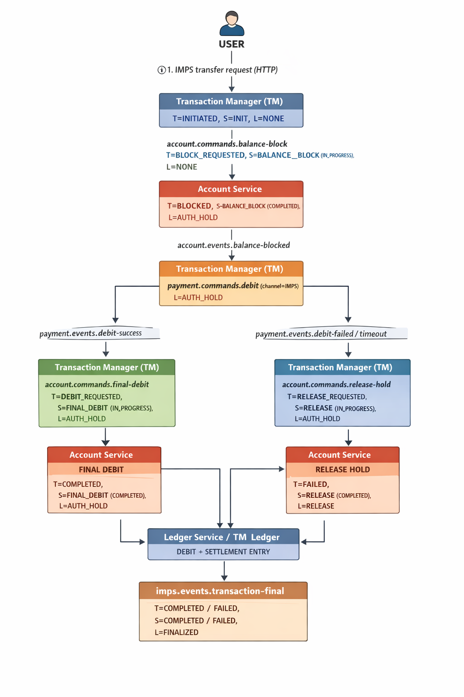

# IMPS Transaction Flow

This document describes the **IMPS payment transaction flow** from a user and system orchestration perspective using an event-driven Saga pattern.

---

## 📌 Overview

IMPS transactions are processed using an **event-driven orchestration model** involving:

* Transaction Manager (TM)
* Account Service
* Payment Network (IMPS / NPCI)
* Ledger Service

Each step maintains:

* **T** → Transaction Status
* **S** → Saga Step / Saga Status
* **L** → Ledger Status

---

## 🖼 IMPS Flow Diagram



> The above diagram represents the complete IMPS lifecycle from user request to ledger finalization.

---

## 🔁 Step-by-Step Flow

### 1. User Initiates Transfer

* **T** = INITIATED
* **S** = INIT
* **L** = NONE

TM receives the HTTP IMPS request.

---

### 2. Balance Block Request

TM emits:

```
account.commands.balance-block
```

* **T** = BLOCK_REQUESTED
* **S** = BALANCE_BLOCK (IN_PROGRESS)
* **L** = NONE

---

### 3. Balance Blocked

Account Service emits:

```
account.events.balance-blocked
```

* **T** = BLOCKED
* **S** = BALANCE_BLOCK (COMPLETED)
* **L** = AUTH_HOLD

---

### 4. Network Debit Request

TM emits:

```
payment.commands.debit (channel=IMPS)
```

* **T** = NETWORK_REQUESTED
* **S** = IMPS_DEBIT (IN_PROGRESS)
* **L** = AUTH_HOLD

---

### 5. NPCI Processing

IMPS Network emits:

* `payment.events.debit-success`
* or `payment.events.debit-failed / timeout`

Success:

* **S** = IMPS_DEBIT (COMPLETED)

Failure:

* **S** = IMPS_DEBIT (FAILED)

Ledger remains on hold.

---

### 6. Success Path

TM emits:

```
account.commands.final-debit
```

Account Service emits:

```
account.events.balance-debited
```

* **T** = COMPLETED
* **S** = FINAL_DEBIT (COMPLETED)
* **L** = DEBIT + SETTLEMENT

Ledger records debit.

---

### 7. Failure Path

TM emits:

```
account.commands.release-hold
```

Account Service emits:

```
account.events.balance-released
```

* **T** = FAILED
* **S** = RELEASE (COMPLETED)
* **L** = RELEASE

Ledger records reversal.

---

### 8. Final Event

TM emits:

```
imps.events.transaction-final
```

* **T** = COMPLETED / FAILED
* **S** = COMPLETED / FAILED
* **L** = FINALIZED

This event is consumed by downstream systems like notifications, reconciliation, and reporting.

---

## Key Design Principles

* Saga orchestrates business flow
* Ledger reflects accounting truth
* Compensation is mandatory on failure
* Saga is completed only after ledger safety
* Events are immutable and idempotent

---

